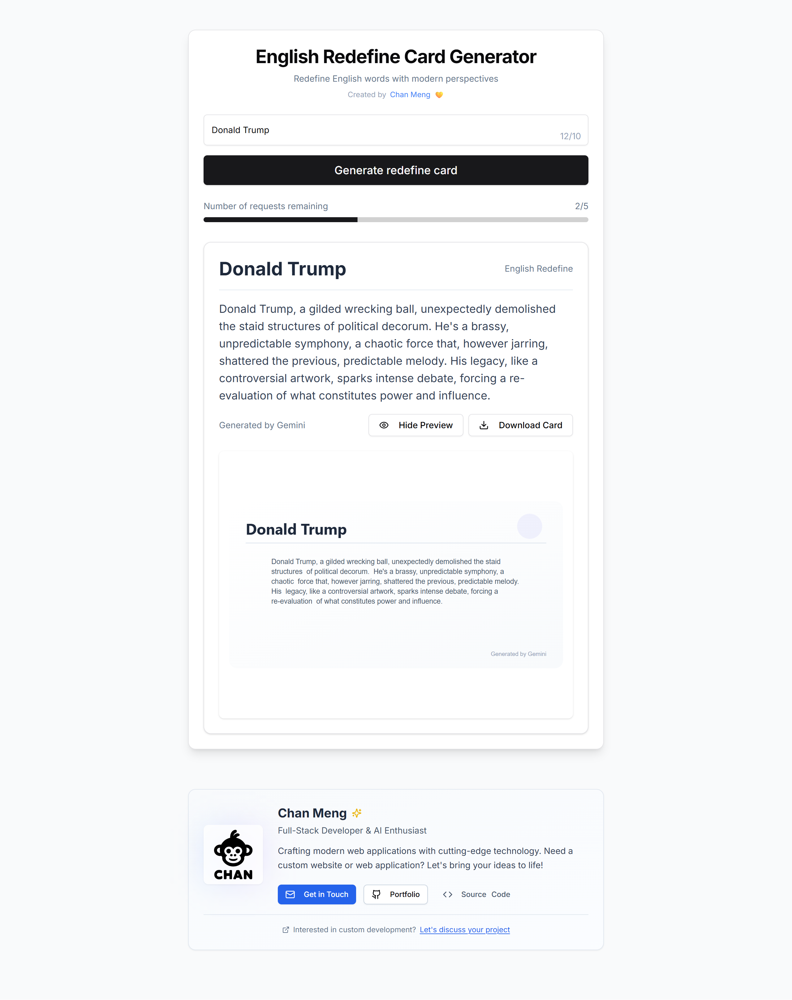
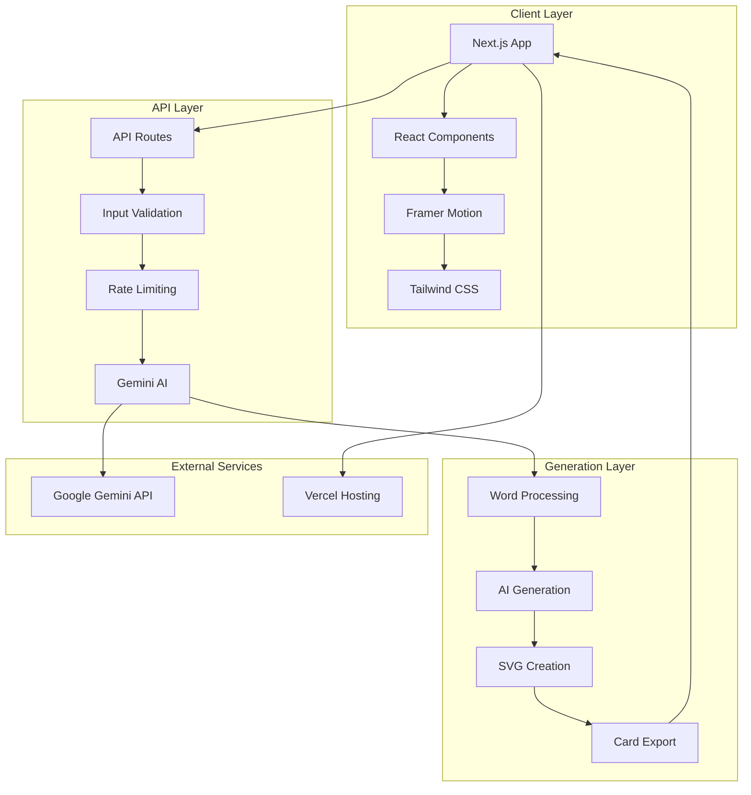

<div align="center"><a name="readme-top"></a>

[](#)

# 🔄 English Redefine<br/><h3>AI-Powered Modern Word Interpretation Platform</h3>

An innovative English language platform that leverages Google's Gemini AI to provide fresh, contemporary interpretations of English words.<br/>
Supports **beautiful card generation**, **SVG export**, and **responsive design** with extensible architecture.<br/>
One-click **FREE** deployment for your modern word interpretation needs.

[Live Demo][project-link] · [Documentation][docs-link] · [Report Issues][github-issues-link] · [Request Features][github-issues-link]

<br/>

[][project-link]

<br/>

<!-- SHIELD GROUP -->

[![][github-release-shield]][github-release-link]
[![][vercel-shield]][vercel-link]
[![][github-stars-shield]][github-stars-link]
[![][github-forks-shield]][github-forks-link]<br/>
[![][github-issues-shield]][github-issues-link]
[![][github-license-shield]][github-license-link]
[![][github-contributors-shield]][github-contributors-link]

**Share English Redefine**

[![][share-x-shield]][share-x-link]
[![][share-telegram-shield]][share-telegram-link]
[![][share-whatsapp-shield]][share-whatsapp-link]
[![][share-reddit-shield]][share-reddit-link]
[![][share-linkedin-shield]][share-linkedin-link]

<sup>🌟 Revolutionizing English language learning with AI-powered insights. Built for modern learners, educators, and language enthusiasts.</sup>

## 📸 Project Screenshots

> [!TIP]
> Experience English words in a completely new light with our AI-powered redefinition platform.

<div align="center">
  
  <p><em>Complete Website Interface - Full application view with modern design</em></p>
</div>

<details>
<summary><kbd>📱 More Screenshots</kbd></summary>

<div align="center">
  
  <p><em>Additional Interface View - Detailed application functionality</em></p>
</div>

<br/>

<div align="center">
  
  <p><em>Main Interface Demo - Clean, intuitive word input and generation</em></p>
</div>

<div align="center">
  
  <p><em>Generated Card - Beautiful, downloadable word interpretation cards</em></p>
</div>

</details>

## 🎬 Demo Video

> [!NOTE]
> Watch English Redefine in action - from word input to beautiful card generation and download.

<div align="center">

[](https://english-redefine.vercel.app/)

*Click to visit the live application*

</div>

**Tech Stack Badges:**

<div align="center">

 
 
 
 
 
 

</div>

</div>

> [!IMPORTANT]
> This project demonstrates modern full-stack development with **Next.js 15**, **Google Gemini AI integration**, and **advanced UI animations**. It combines cutting-edge AI technology with beautiful design to provide fresh perspectives on English vocabulary.

<details>
<summary><kbd>📑 Table of Contents</kbd></summary>

#### TOC

- [🔄 English RedefineAI-Powered Modern Word Interpretation Platform](#-english-redefineai-powered-modern-word-interpretation-platform)
  - [📸 Project Screenshots](#-project-screenshots)
  - [🎬 Demo Video](#-demo-video)
      - [TOC](#toc)
      - [](#)
  - [🌟 Introduction](#-introduction)
  - [✨ Key Features](#-key-features)
    - [`1` AI-Powered Word Redefinition](#1-ai-powered-word-redefinition)
    - [`2` Beautiful Card Generation](#2-beautiful-card-generation)
    - [`*` Additional Features](#-additional-features)
  - [🛠️ Tech Stack](#️-tech-stack)
  - [🏗️ Architecture](#️-architecture)
    - [System Architecture](#system-architecture)
    - [Component Structure](#component-structure)
  - [⚡️ Performance](#️-performance)
  - [🚀 Getting Started](#-getting-started)
    - [Prerequisites](#prerequisites)
    - [Quick Installation](#quick-installation)
    - [Environment Setup](#environment-setup)
  - [🛳 Deployment](#-deployment)
    - [Cloud Deployment (Recommended)](#cloud-deployment-recommended)
    - [Environment Variables](#environment-variables)
  - [📖 Usage Guide](#-usage-guide)
    - [Basic Usage](#basic-usage)
    - [Advanced Features](#advanced-features)
  - [🔌 API Reference](#-api-reference)
    - [Generate Word Definition](#generate-word-definition)
  - [⌨️ Development](#️-development)
    - [Development Scripts](#development-scripts)
    - [Adding Features](#adding-features)
  - [🤝 Contributing](#-contributing)
  - [📄 License](#-license)
  - [👥 Author](#-author)

####

<br/>

</details>

## 🌟 Introduction

English Redefine is a revolutionary platform that transforms how we understand and interact with English vocabulary. By leveraging Google's advanced Gemini AI technology, we provide fresh, contemporary interpretations of English words that bridge traditional meanings with modern perspectives.

Whether you're a language learner, educator, content creator, or simply someone passionate about words, English Redefine offers a unique playground for exploring language in new and exciting ways.

> [!NOTE]
> - Google Gemini API key required for AI functionality
- Modern browser with JavaScript enabled
- No registration required - start exploring immediately!

| [![][demo-shield-badge]][project-link]   | No installation required! Visit our live demo to experience AI-powered word redefinition.                           |
| :------------------------------------ | :--------------------------------------------------------------------------------------------- |

> [!TIP]
> **⭐ Star us** to stay updated with the latest features and improvements!

[![][image-star]][github-stars-link]

## ✨ Key Features

### `1` AI-Powered Word Redefinition

Experience cutting-edge artificial intelligence that reinterprets English words with fresh, modern perspectives. Our Gemini AI integration provides contextual, creative, and insightful definitions that connect traditional meanings with contemporary life.

<div align="center">
  
  <p><em>AI-powered word redefinition in action</em></p>
</div>

**Key Capabilities:**
- 🧠 **Intelligent Analysis**: Context-aware interpretations
- 🎯 **Modern Relevance**: Contemporary perspectives on classic words  
- 💡 **Creative Insights**: Metaphorical and philosophical viewpoints
- 🛡️ **Safe Content**: Built-in content filtering and validation

[![][back-to-top]](#readme-top)

### `2` Beautiful Card Generation

Transform word definitions into visually stunning, professionally designed cards that can be shared, downloaded, and used across various platforms.

<div align="center">
  
  <p><em>Beautiful, customizable word definition cards</em></p>
</div>

**Design Features:**
- 🎨 **Modern Aesthetics**: Clean, professional design system
- 📱 **Responsive Layout**: Perfect on all screen sizes
- 🎭 **Dynamic Styling**: Gradient backgrounds and decorative elements
- 💾 **SVG Export**: High-quality vector format for any use case

[![][back-to-top]](#readme-top)

### `*` Additional Features

Beyond core functionality, English Redefine includes:

- [x] ⚡ **Instant Generation**: Real-time AI processing with loading states
- [x] 🔒 **Rate Limiting**: Smart request management (5 per minute)
- [x] 📊 **Usage Tracking**: Visual progress indicators for remaining requests
- [x] 🎬 **Smooth Animations**: Framer Motion powered transitions
- [x] 🌐 **Responsive Design**: Mobile-first, works everywhere
- [x] 🔍 **Live Preview**: See your card before downloading
- [x] 📥 **One-Click Download**: SVG export with custom naming
- [x] ⚠️ **Error Handling**: User-friendly error messages and validation

> ✨ More features are continuously being added based on user feedback and modern web standards.

<div align="right">

[![][back-to-top]](#readme-top)

</div>

## 🛠️ Tech Stack

<div align="center">
  <table>
    <tr>
      <td align="center" width="96">
        
        <br>Next.js 15
      </td>
      <td align="center" width="96">
        
        <br>React 18
      </td>
      <td align="center" width="96">
        
        <br>TypeScript 5
      </td>
      <td align="center" width="96">
        
        <br>Gemini AI
      </td>
      <td align="center" width="96">
        
        <br>Tailwind CSS
      </td>
      <td align="center" width="96">
        
        <br>Framer Motion
      </td>
    </tr>
  </table>
</div>

**Frontend Stack:**
- **Framework**: Next.js 15 with App Router
- **Language**: TypeScript for type safety
- **Styling**: Tailwind CSS + Custom Design System
- **Animation**: Framer Motion for smooth transitions
- **UI Components**: Radix UI + shadcn/ui
- **Icons**: Lucide React

**AI & Backend:**
- **AI Platform**: Google Gemini Pro
- **API Routes**: Next.js API routes
- **Rate Limiting**: Built-in IP-based limiting
- **Validation**: Custom word validation system
- **Error Handling**: Comprehensive error management

**Development Tools:**
- **Build Tool**: Next.js built-in bundler
- **Linting**: ESLint with Next.js config
- **Type Checking**: TypeScript compiler
- **Package Manager**: npm/yarn/pnpm support

> [!TIP]
> Each technology was carefully selected for optimal performance, developer experience, and maintainability.

## 🏗️ Architecture

### System Architecture



### Component Structure

```
src/
├── app/
│   ├── page.tsx           # Home page
│   ├── layout.tsx         # Root layout
│   ├── globals.css        # Global styles
│   └── api/
│       └── generate/
│           └── route.ts   # AI generation API
├── components/
│   ├── CardGenerator.tsx  # Main app component
│   ├── ResultCard.tsx     # Result display
│   ├── DownloadButton.tsx # Export functionality
│   ├── SVGPreview.tsx     # Live preview
│   └── ui/               # Reusable UI components
└── lib/
    ├── svgGenerator.ts    # SVG creation logic
    ├── animations.ts      # Motion variants
    ├── errors.ts          # Error handling
    └── utils.ts           # Utility functions
```

## ⚡️ Performance

**Key Metrics:**
- ⚡ **Fast Loading**: Optimized Next.js build with code splitting
- 🚀 **Quick AI Response**: Average 2-3 second generation time
- 💨 **Smooth Animations**: 60fps transitions with Framer Motion
- 📱 **Mobile Optimized**: Perfect performance on all devices
- 🔄 **Efficient Caching**: Smart request caching and rate limiting

**Performance Optimizations:**
- 🎯 **Code Splitting**: Automatic route-based splitting
- 🖼️ **Lazy Loading**: Components load on demand
- 📦 **Bundle Optimization**: Tree-shaking and minification
- 🔄 **Request Optimization**: Built-in rate limiting prevents abuse

## 🚀 Getting Started

### Prerequisites

> [!IMPORTANT]
> Ensure you have the following installed:

- Node.js 18.0+ ([Download](https://nodejs.org/))
- npm/yarn/pnpm package manager
- Google Gemini API key ([Get one here](https://ai.google.dev/))

### Quick Installation

**1. Clone Repository**

```bash
git clone https://github.com/ChanMeng666/english-redefine.git
cd english-redefine
```

**2. Install Dependencies**

```bash
# Using npm
npm install

# Using yarn
yarn install

# Using pnpm (recommended)
pnpm install
```

**3. Environment Setup**

```bash
# Create environment file
cp .env.example .env.local

# Add your Gemini API key
echo "GEMINI_API_KEY=your_gemini_api_key_here" >> .env.local
```

**4. Start Development**

```bash
npm run dev
```

🎉 **Success!** Open [http://localhost:3000](http://localhost:3000) to start redefining words!

### Environment Setup

Create `.env.local` file with:

```bash
# Required: Google Gemini API Key
GEMINI_API_KEY=your_gemini_api_key_here

# Optional: Custom configuration
NEXT_PUBLIC_APP_NAME=English Redefine
NEXT_PUBLIC_MAX_REQUESTS=5
```

> [!TIP]
> Get your free Gemini API key from [Google AI Studio](https://makersuite.google.com/app/apikey)

## 🛳 Deployment

### Cloud Deployment (Recommended)

**Deploy with Vercel:**

[](https://vercel.com/new/clone?repository-url=https://github.com/ChanMeng666/english-redefine&env=GEMINI_API_KEY&envDescription=Google%20Gemini%20API%20Key%20required%20for%20AI%20functionality)

**Manual Deployment:**

```bash
# Install Vercel CLI
npm i -g vercel

# Deploy to production
vercel --prod
```

**Other Platforms:**

<div align="center">

|           Deploy with Netlify            |                     Deploy with Railway                      |
| :-------------------------------------: | :---------------------------------------------------------: |
| [](https://app.netlify.com/start/deploy?repository=https://github.com/ChanMeng666/english-redefine) | [](https://railway.app/new/template?template=https://github.com/ChanMeng666/english-redefine) |

</div>

### Environment Variables

| Variable | Description | Required | Example |
|----------|-------------|----------|---------|
| `GEMINI_API_KEY` | Google Gemini API key for AI functionality | ✅ | `AIza...` |
| `NEXT_PUBLIC_APP_NAME` | Application name | 🔶 | `English Redefine` |

> [!WARNING]
> Never commit your API keys to version control. Use secure environment variable management in production.

## 📖 Usage Guide

### Basic Usage

1. **Enter a Word**: Type any English word into the input field
2. **Generate Definition**: Click "Generate redefine card" to get AI interpretation
3. **Preview Card**: Use "Preview Card" to see the generated design
4. **Download**: Click "Download Card" to save as SVG file

### Advanced Features

**Rate Limiting:**
- 5 requests per minute per IP address
- Visual progress bar shows remaining requests
- Automatic reset every 60 seconds

**Word Validation:**
- Supports English letters, spaces, hyphens, apostrophes
- Maximum 50 characters per word
- Automatic input sanitization

**Card Customization:**
- Responsive design adapts to screen size
- High-quality SVG export format
- Professional typography and spacing

## 🔌 API Reference

### Generate Word Definition

**Endpoint:** `POST /api/generate`

**Request Body:**
```json
{
  "word": "example"
}
```

**Response:**
```json
{
  "result": "Modern interpretation of the word...",
  "remaining": 4
}
```

**Error Responses:**

| Status | Error | Description |
|--------|-------|-------------|
| 400 | Validation error | Invalid input word |
| 429 | Rate limit exceeded | Too many requests |
| 500 | Server error | AI generation failed |

## ⌨️ Development

### Development Scripts

```bash
# Development
npm run dev          # Start development server
npm run build        # Build for production  
npm run start        # Start production server
npm run lint         # Run ESLint

# Type Checking
npx tsc --noEmit     # TypeScript type checking
```

### Adding Features

**1. Create Feature Branch:**
```bash
git checkout -b feature/amazing-feature
```

**2. Follow Project Structure:**
- Add components to `components/`
- Add utilities to `lib/`
- Add types to existing TypeScript files
- Update documentation

**3. Test Your Changes:**
```bash
npm run build        # Ensure build passes
npm run lint         # Check code style
```

## 🤝 Contributing

We welcome contributions! Here's how you can help:

**Ways to Contribute:**
- 🐛 **Bug Reports**: Found an issue? Let us know!
- 💡 **Feature Requests**: Have an idea? Share it!
- 📚 **Documentation**: Help improve our docs
- 🔧 **Code**: Submit pull requests

**Development Process:**
1. Fork the repository
2. Create your feature branch
3. Make your changes
4. Add tests if applicable
5. Submit a pull request

**Contribution Guidelines:**
- Follow existing code style
- Write clear commit messages
- Update documentation as needed
- Be respectful and constructive

[](https://github.com/ChanMeng666/english-redefine/graphs/contributors)

## 📄 License

This project is licensed under the MIT License - see the [LICENSE](LICENSE) file for details.

**Open Source Benefits:**
- ✅ Commercial use allowed
- ✅ Modification allowed
- ✅ Distribution allowed
- ✅ Private use allowed

## 👥 Author

**Chan Meng**
-  LinkedIn: [chanmeng666](https://www.linkedin.com/in/chanmeng666/)
-  GitHub: [ChanMeng666](https://github.com/ChanMeng666)
-  Email: [chanmeng.dev@gmail.com](mailto:chanmeng.dev@gmail.com)
-  Website: [chanmeng.live](https://2d-portfolio-eta.vercel.app/)

---

<div align="center">
<strong>🔄 Redefining English Words with AI Power 🚀</strong>
<br/>
<em>Empowering language learners and word enthusiasts worldwide</em>
<br/><br/>

⭐ **Star us on GitHub** • 🚀 **Try the Live Demo** • 🐛 **Report Issues** • 💡 **Request Features** • 🤝 **Contribute**

<br/><br/>

**Made with ❤️ for the English language community**


</div>

---

<!-- LINK DEFINITIONS -->

[back-to-top]: https://img.shields.io/badge/-BACK_TO_TOP-151515?style=flat-square

<!-- Project Links -->
[project-link]: https://english-redefine.vercel.app/
[docs-link]: https://github.com/ChanMeng666/english-redefine#readme

<!-- GitHub Links -->
[github-issues-link]: https://github.com/ChanMeng666/english-redefine/issues
[github-stars-link]: https://github.com/ChanMeng666/english-redefine/stargazers
[github-forks-link]: https://github.com/ChanMeng666/english-redefine/forks
[github-contributors-link]: https://github.com/ChanMeng666/english-redefine/contributors
[github-release-link]: https://github.com/ChanMeng666/english-redefine/releases

<!-- Shield Badges -->
[github-release-shield]: https://img.shields.io/github/v/release/ChanMeng666/english-redefine?color=369eff&labelColor=black&logo=github&style=flat-square
[vercel-shield]: https://img.shields.io/badge/vercel-online-55b467?labelColor=black&logo=vercel&style=flat-square
[github-contributors-shield]: https://img.shields.io/github/contributors/ChanMeng666/english-redefine?color=c4f042&labelColor=black&style=flat-square
[github-forks-shield]: https://img.shields.io/github/forks/ChanMeng666/english-redefine?color=8ae8ff&labelColor=black&style=flat-square
[github-stars-shield]: https://img.shields.io/github/stars/ChanMeng666/english-redefine?color=ffcb47&labelColor=black&style=flat-square
[github-issues-shield]: https://img.shields.io/github/issues/ChanMeng666/english-redefine?color=ff80eb&labelColor=black&style=flat-square
[github-license-shield]: https://img.shields.io/badge/license-MIT-white?labelColor=black&style=flat-square

<!-- Badge Variants -->
[demo-shield-badge]: https://img.shields.io/badge/TRY%20DEMO-ONLINE-55b467?labelColor=black&logo=vercel&style=for-the-badge

<!-- Social Share Links -->
[share-x-link]: https://x.com/intent/tweet?hashtags=AI,English,Education&text=Check%20out%20English%20Redefine%20-%20AI-powered%20word%20interpretation!&url=https%3A%2F%2Fgithub.com%2FChanMeng666%2Fenglish-redefine
[share-telegram-link]: https://t.me/share/url?text=English%20Redefine%20-%20AI%20Word%20Interpretation&url=https%3A%2F%2Fgithub.com%2FChanMeng666%2Fenglish-redefine
[share-whatsapp-link]: https://api.whatsapp.com/send?text=Check%20out%20English%20Redefine%20https%3A%2F%2Fgithub.com%2FChanMeng666%2Fenglish-redefine
[share-reddit-link]: https://www.reddit.com/submit?title=English%20Redefine%20-%20AI%20Word%20Interpretation&url=https%3A%2F%2Fgithub.com%2FChanMeng666%2Fenglish-redefine
[share-linkedin-link]: https://linkedin.com/sharing/share-offsite/?url=https://github.com/ChanMeng666/english-redefine

[share-x-shield]: https://img.shields.io/badge/-share%20on%20x-black?labelColor=black&logo=x&logoColor=white&style=flat-square
[share-telegram-shield]: https://img.shields.io/badge/-share%20on%20telegram-black?labelColor=black&logo=telegram&logoColor=white&style=flat-square
[share-whatsapp-shield]: https://img.shields.io/badge/-share%20on%20whatsapp-black?labelColor=black&logo=whatsapp&logoColor=white&style=flat-square
[share-reddit-shield]: https://img.shields.io/badge/-share%20on%20reddit-black?labelColor=black&logo=reddit&logoColor=white&style=flat-square
[share-linkedin-shield]: https://img.shields.io/badge/-share%20on%20linkedin-black?labelColor=black&logo=linkedin&logoColor=white&style=flat-square

<!-- Images -->
[image-star]: https://github.com/user-attachments/assets/c601b8c5-0560-4b2b-9833-40c8f775c405
[vercel-link]: https://english-redefine.vercel.app/

